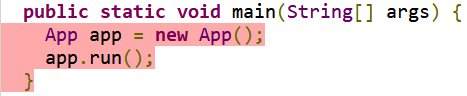
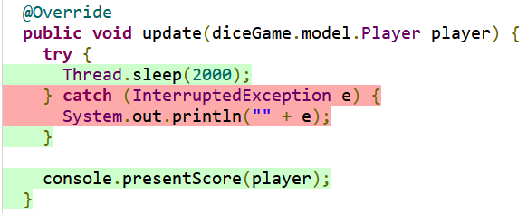

# Assignment 1 part 2 TDD

## Description
The application is a simple dice game that lets the user play against the computer, rolling two dice each and comparing the score. Highest score wins, if equal the computer wins. To run the application, run the command ```./gradlew run -q --console=plain``` in the console. (To build, run ```./gradlew build```.)   

The appliction is developed in a TDD manner with JUnit Jupiter as the testing framework, Mockito as the mocking library and JaCoCo as the code coverage tool. To run the tests, run the command ```./gradlew test```. The coverage report is found in the build/jacoco folder.   

A couple of previous coverage reports are found in the coverage folder. ([Go to the latest report.](./coverage/report2.md)) 

## Uncovered code
Some code could not be covered by tests, and here is a short explanation of why.

### controller.App.main()
The method is a static main method and it only contains a couple of instructions.   



### controller.Player.update()
The catch statement in the method can't be tested since the Thread class' static method sleep() can't be controlled.  



